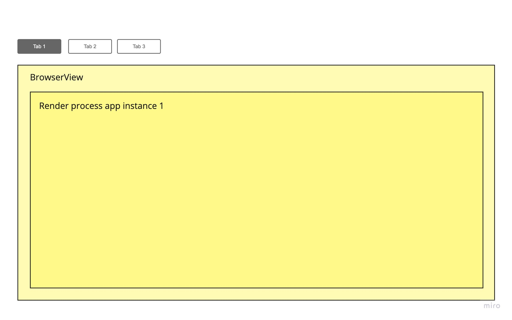
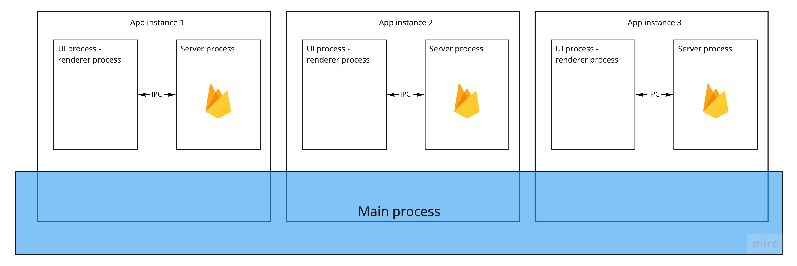

## Electron multiple tabs:

- Implement user's familiar UX tabs - Like what chrome does
- Hotkeys all the thing (Cmd + T for a new tab, Cmd + W to the closing current one)
- Fast

## How

Using `webview` under the hook to implement multiple tab
Using node-ipc to make server instance comunicate

## Demo

https://www.youtube.com/watch?v=U9RA9_Imt90&ab_channel=ThanhLe

## More detail

https://thanhle.blog/blog/electron-multiple-Tabs-without-dealing-with-performance
